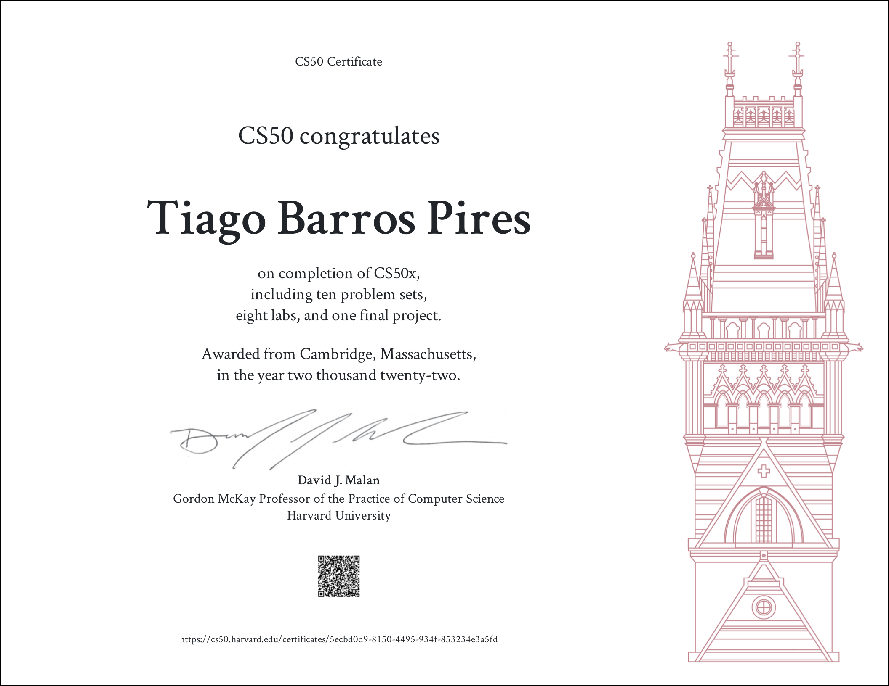

# CS50x 2022 

CS50x is a Harvard University's introduction to the intellectual enterprises of computer science and the art of programming for majors and non-majors alike, with or without prior programming experience. You can find the materials and more about the course [here](https://cs50.harvard.edu/x).

I created this repository to save all my solutions for the problems proposed on the course. Every exercise scored 100% on submission!

> Quick word! If you're considering taking this course, I highly recommend you to do it. It's an amazing course and you'll not regret it :rocket:

## Academic Honesty
> Please try to solve the problems before taking a look at any of my solutions. Only then will you have the best use of the course.
<br/>Check the [Academic Honesty](https://cs50.harvard.edu/x/2020/honesty/) policy of the course.

## My problem sets solutions

### Scratch - week 0
Link to play the game that I created :
```
https://scratch.mit.edu/projects/433583706/
```

### C - weeks 1 to 5
> The problems use the CS50 Library for C, you can check it [here](https://github.com/cs50/libcs50)
- [Problem Set 1: C](/pset1)
  * [hello](/pset1/hello.c)
  * mario
    + [less](/pset1/mario_less.c)
    + [more](/pset1/mario_more.c)
  * [cash](/pset1/cash.c)
  * [credit](/pset1/credit.c)
  * [lab - Population](/labs/lab1)
- [Problem Set 2: Arrays](/pset2)
  * [readability](/pset2/readability.c)
  * [caesar](/pset2/caesar.c)
  * [substitution](/pset2/substitution.c)
  * [lab - Scrabble](/labs/lab2)
- [Problem Set 3: Algorithms](/pset3)
  * [plurality](/pset3/plurality.c)
  * [runoff](/pset3/runoff.c)
  * [lab - Answers](/labs/lab3)
- [Problem Set 4: Memmory](/pset4)
  * filter
    + [less](/pset4/filter_less)
    + [more](/pset4/filter_more)
  * [recover](/pset4/recover)
  * [lab - Volume](/labs/lab4)
- [Problem Set 5: Data Structures](/pset5)
  * [speller](/pset5/speller.c)
  * [lab - Inheritance](/labs/lab5)
 
### Python - week 6 
- [Problem Set 6: Python](/pset6)
  * [hello](/pset6/hello.py)
  * [mario]
    + [less](/pset6/mario_less.py)
    + [more](/pset6/mario_more.py)
  * [cash](/pset6/cash.py)
  * [credit](/pset6/credit.py)
  * [readability](/pset6/readability.py)
  * [dna](/pset6/dna)
  * [lab - World Cup](/labs/lab6)
 
### SQL - week 7
- [Problem Set 7: SQL](/pset7)
  * [movies](/pset7/movies)
  * [fiftyville](/pset7/fiftyville)
  * [lab - Songs](/labs/lab7)
  
### Web Development- weeks 8 to 10
- [Problem Set 8: HTML, CSS and Javascript](/pset8)
  * [homepage](/pset8/homepage)
  * [lab - Trivia](/labs/lab8)
- [Problem Set 8: Flask](/pset9)
  * [lab - Birthdays](/labs/lab9)
- Final Project: Readme Creator
  
  Readme Creator is a website to create outstanding README's for your profile and projects easily. You can check it [here](https://readmecreator.herokuapp.com/).

  All the code is under MIT license, avaiable [here](https://github.com/tiagobpires/readme-creator). Feel free to contribute :D!

## Contact


Made with ❤️ by [Tiago Barros](https://github.com/tiagobpires).
Feel free to contact me to discuss any of the solutions, or even just talk! 😊

<p ><a href="https://www.linkedin.com/in/rafaelbpires" target="_blank"></a></p>
</br>

## CS50 Certificate



That was CS50! A big thanks to David Malan and all staff!
